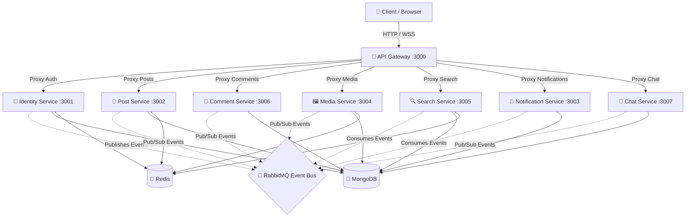
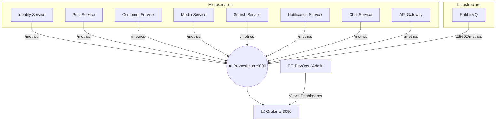

# 🌐 Social Media Microservices Backend

A high-performance, distributed social media backend system designed with a modern microservices architecture. It features event-driven communication via RabbitMQ, real-time bidirectional messaging, Docker-based container orchestration, and comprehensive observability with Prometheus and Grafana.

---

## 📑 Table of Contents

- [Features](#-features)
- [Architecture](#-architecture)
  - [System Architecture](#system-architecture)
  - [Observability Architecture](#observability-architecture)
- [Microservices Overview](#-microservices-overview)
- [Tech Stack](#-tech-stack)
- [Getting Started](#-getting-started)
  - [Prerequisites](#prerequisites)
  - [Installation & Running](#installation--running)
- [API Documentation](#-api-documentation)
- [Environment Variables](#-environment-variables)

---

## ✨ Features

- **Microservices Architecture:** 7 specialized, decoupled Node.js services.
- **Event-Driven Communication:** Asynchronous inter-service communication using RabbitMQ.
- **API Gateway:** Centralized entry point with proxying and authentication handling.
- **Real-Time Features:** WebSocket implementation for chat and notifications.
- **Robust Observability:** Complete monitoring using Prometheus and Grafana.
- **Security:** Rate limiting (Redis-backed), Helmet, and JWT authentication.
- **Containerized:** Fully Dockerized setup using `docker-compose`.

---

## 🏗 Architecture

### System Architecture

The following diagram illustrates the flow of requests from the client through the API Gateway, and how services interact asynchronously via RabbitMQ.



### Observability Architecture

This system has a robust observability stack that collects metrics from every service, stores them in Prometheus, and visualizes them in Grafana.



---

## 🧩 Microservices Overview

| Service | Port | Description |
|---|---|---|
| **API Gateway** | `3000` | Routes requests, checks rate limits, and validates JWTs before forwarding. |
| **Identity Service** | `3001` | Handles user registration, login, and JWT generation using Argon2 for hashing. |
| **Post Service** | `3002` | Manages creating, fetching, liking, and deleting posts. Caches hot posts in Redis. |
| **Notification Service**| `3003` | Listens to RabbitMQ events to generate user notifications. |
| **Media Service** | `3004` | Handles image/video uploads to Cloudinary and validates file types. |
| **Search Service** | `3005` | Indexes content to allow fast full-text searching across posts and users. |
| **Comment Service** | `3006` | Manages post comments and emits events when new comments are created. |
| **Chat Service** | `3007` | Real-time 1-on-1 and group messaging using WebSockets. |

---

## 🛠 Tech Stack

- **Backend:** Node.js, Express.js
- **Database:** MongoDB (Mongoose)
- **Cache / Rate Limiting:** Redis (ioredis)
- **Message Broker:** RabbitMQ (amqplib)
- **Media Storage:** Cloudinary
- **Observability:** Prometheus (prom-client), Grafana
- **Containerization:** Docker, Docker Compose
- **Security:** Helmet, express-rate-limit, JWT, Argon2

---

## 🚀 Getting Started

### Prerequisites

- [Docker](https://www.docker.com/) and [Docker Compose](https://docs.docker.com/compose/) installed
- [Node.js](https://nodejs.org/) 18+ (for local non-docker development)
- Cloudinary Account (for Media Service)

### Installation & Running

1. **Clone the repository:**
   ```bash
   git clone https://github.com/Ambar-Gupta22/social-media-microservices-backend.git
   cd social-media-microservices-backend
   ```

2. **Set up Environment Variables:**
   A script or manual process is needed to create `.env` files in each service folder. You can use the provided `.env.example` as a template for:
   - `api-gateway/.env`
   - `identity-service/.env`
   - `post-service/.env`
   - `comment-service/.env`
   - `media-service/.env`
   - `search-service/.env`
   - `notification-service/.env`
   - `chat-service/.env`

3. **Start the infrastructure with Docker:**
   ```bash
   docker-compose up -d --build
   ```

4. **Access the Application:**
   - Main API Gateway: `http://localhost:3000`
   - Grafana Dashboards: `http://localhost:3050` (Login: `admin` / `admin`)
   - Prometheus: `http://localhost:9090`
   - RabbitMQ Management: `http://localhost:15672` (guest/guest)

To shut down the cluster and clean up resources:
```bash
docker-compose down
```

---

## 📚 API Documentation

All requests should be routed through the API Gateway at `http://localhost:3000/v1/...`

### Identity Endpoints (`/v1/auth`)
| Method | Endpoint | Auth Required | Description |
|---|---|---|---|
| POST | `/register` | No | Register a new user |
| POST | `/login` | No | Login and receive JWT |

### Post Endpoints (`/v1/posts`)
| Method | Endpoint | Auth Required | Description |
|---|---|---|---|
| POST | `/create-post` | Yes | Create a new post |
| GET | `/all-posts` | Yes | Fetch all posts |
| GET | `/:id` | Yes | Get post details |
| DELETE| `/:id` | Yes | Delete a post |

### Comment Endpoints (`/v1/comments`)
| Method | Endpoint | Auth Required | Description |
|---|---|---|---|
| POST | `/create-comment`| Yes | Add a comment to a post |
| GET | `/post/:postId` | Yes | Get comments for a post |

### Media Endpoints (`/v1/media`)
| Method | Endpoint | Auth Required | Description |
|---|---|---|---|
| POST | `/upload` | Yes | Upload an image/video (multipart/form-data) |

### Search Endpoints (`/v1/search`)
| Method | Endpoint | Auth Required | Description |
|---|---|---|---|
| GET | `/posts?query=...` | Yes | Search for posts by content |

---

## 🔒 Environment Variables

Example `.env` configuration (must be present in the root or specific service folders depending on your setup):

```env
PORT=3000
MONGODB_URI=mongodb://mongodb:27017/post_db
REDIS_URL=redis://redis:6379
RABBITMQ_URL=amqp://rabbitmq:5672

# JWT 
JWT_SECRET=your_super_secret_key

# Cloudinary (Media Service)
CLOUDINARY_CLOUD_NAME=your_cloud_name
CLOUDINARY_API_KEY=your_api_key
CLOUDINARY_API_SECRET=your_api_secret
```

---

*Architected and developed with scalability and system stability in mind.*
